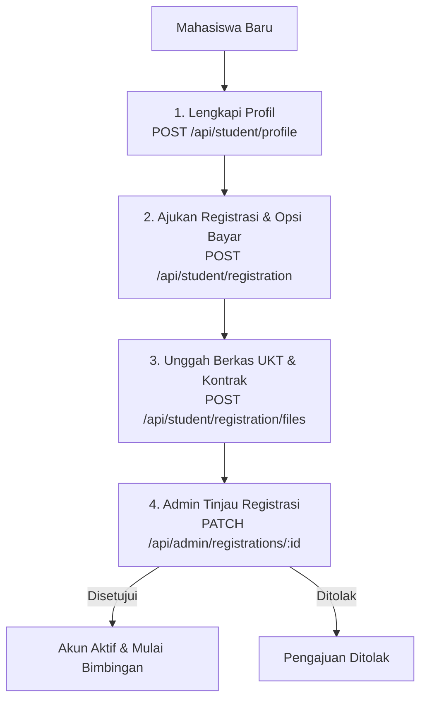
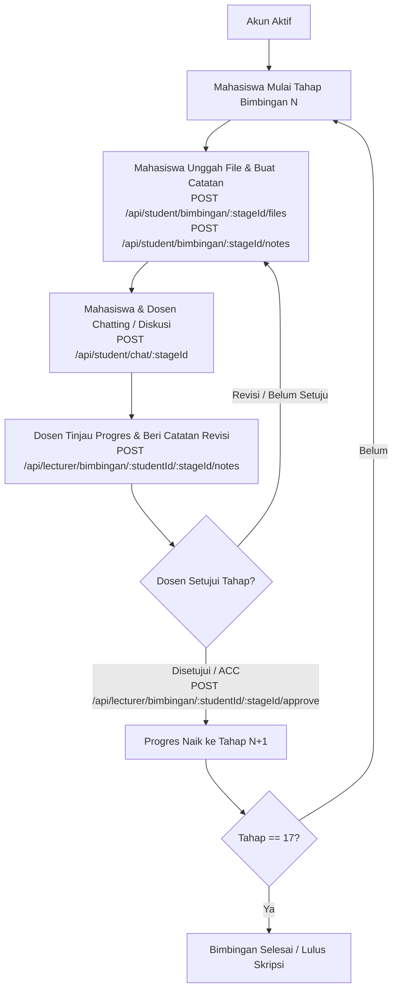

# 📖 Dokumentasi API SIBITA (Sistem Bimbingan Tugas Akhir)

Dokumentasi ini menjelaskan spesifikasi lengkap API yang digunakan pada sistem SIBITA. Sistem ini mencakup alur registrasi mahasiswa, pelacakan 17 tahapan bimbingan skripsi, diskusi interaktif (chat) antara mahasiswa dan dosen, serta administrasi peran oleh admin dan superadmin.

---

## 🗺️ Alur Sistem (Flowcharts)

### 1. Alur Registrasi Mahasiswa Baru

### 2. Alur Proses Bimbingan (17 Tahapan)

---

## 🔒 Keamanan & Autentikasi

Sebagian besar API dilindungi dan membutuhkan login. Autentikasi didukung melalui dua cara:
1. **Cookie-based Session** (Sesi berbasis cookie yang secara otomatis diset pada header cookie browser saat sign-in menggunakan cookie `better-auth.session_token`).
2. **Bearer Token** (Token sesi yang dikirimkan secara eksplisit melalui header HTTP `Authorization: Bearer <token>`).

## 📡 Kelompok API: 🔐 Authentication (Autentikasi)
API untuk pendaftaran, masuk sesi, keluar sesi, reset password, dan manajemen akun menggunakan Better Auth.

### 🔹 Ganti Password (Aktif Sesi)
Mengubah password yang memerlukan sesi aktif dengan memverifikasi password saat ini.

* **Endpoint:** `POST /api/auth/change-password`
* **Content-Type:** `application/json`
* **Request Body:**
  * `currentPassword` (string, wajib), contoh: `"securepassword123"`
  * `newPassword` (string, wajib), contoh: `"newsecurepassword123"`
* **Respons:**
  * **Status `200`**: Password berhasil diubah.
    * Schema (`application/json`):
      * `success` (boolean, opsional), contoh: `true`
  * **Status `400`**: 
  * **Status `401`**: 

---

### 🔹 Minta Tautan Reset Password
Mengirimkan email berisi tautan reset password yang berlaku selama 30 menit.

* **Endpoint:** `POST /api/auth/forget-password`
* **Content-Type:** `application/json`
* **Request Body:**
  * `email` (string, wajib), contoh: `"budi@student.unud.ac.id"`
* **Respons:**
  * **Status `200`**: Email reset password telah dikirim.
    * Schema (`application/json`):
      * `success` (boolean, opsional), contoh: `true`

---

### 🔹 Dapatkan Detail Sesi Aktif (Cookie)
Mengambil data sesi dan user yang sedang aktif berdasarkan cookie autentikasi `better-auth.session_token`.

* **Endpoint:** `GET /api/auth/get-session`
* **Respons:**
  * **Status `200`**: Detail sesi berhasil ditemukan.
    * Schema (`application/json`):
      * `session` (any, opsional)
      * `user` (any, opsional)
  * **Status `401`**: 

---

### 🔹 Cek Status Sesi
Melakukan verifikasi apakah sesi saat ini masih aktif.

* **Endpoint:** `GET /api/auth/ok`
* **Respons:**
  * **Status `200`**: Sesi valid.
    * Schema (`application/json`):
      * `ok` (boolean, opsional), contoh: `true`
  * **Status `401`**: 

---

### 🔹 Reset Password dengan Token
Mengganti password lama dengan password baru menggunakan token verifikasi reset password.

* **Endpoint:** `POST /api/auth/reset-password`
* **Content-Type:** `application/json`
* **Request Body:**
  * `newPassword` (string, wajib), contoh: `"newsecurepassword123"`
  * `token` (string, wajib), contoh: `"reset-token-value-here"`
* **Respons:**
  * **Status `200`**: Password berhasil diubah. Seluruh sesi lain dicabut otomatis.
    * Schema (`application/json`):
      * `success` (boolean, opsional), contoh: `true`
  * **Status `400`**: 

---

### 🔹 Masuk dengan Email & Password
Masuk ke sistem menggunakan email dan password untuk mendapatkan cookie sesi.

* **Endpoint:** `POST /api/auth/sign-in/email`
* **Content-Type:** `application/json`
* **Request Body:**
  * `email` (string, wajib), contoh: `"budi@student.unud.ac.id"`
  * `password` (string, wajib), contoh: `"securepassword123"`
* **Respons:**
  * **Status `200`**: Autentikasi berhasil. Cookie sesi diset otomatis.
    * Schema (`application/json`):
      * `user` (any, opsional)
      * `session` (any, opsional)
  * **Status `401`**: 

---

### 🔹 Masuk via Google OAuth
Masuk ke sistem menggunakan OAuth Provider (Google).

* **Endpoint:** `POST /api/auth/sign-in/social`
* **Content-Type:** `application/json`
* **Request Body:**
  * `provider` (string, wajib) (`"google"`), contoh: `"google"`
* **Respons:**
  * **Status `200`**: Redirect URI untuk OAuth.
    * Schema (`application/json`):
      * `url` (string, opsional), contoh: `"https://accounts.google.com/o/oauth2/v2/auth..."`

---

### 🔹 Keluar dari Sesi
Menghapus sesi saat ini dan mencabut cookie autentikasi.

* **Endpoint:** `POST /api/auth/sign-out`
* **Respons:**
  * **Status `200`**: Berhasil keluar.
    * Schema (`application/json`):
      * `success` (boolean, opsional), contoh: `true`

---

### 🔹 Pendaftaran Akun Baru (Email & Password)
Mendaftarkan user baru di sistem. Mengirimkan email verifikasi otomatis.

* **Endpoint:** `POST /api/auth/sign-up/email`
* **Content-Type:** `application/json`
* **Request Body:**
  * `name` (string, wajib), contoh: `"Budi Utomo"`
  * `email` (string, wajib), contoh: `"budi@student.unud.ac.id"`
  * `password` (string, wajib), contoh: `"securepassword123"`
* **Respons:**
  * **Status `200`**: Pendaftaran berhasil, periksa email untuk verifikasi.
    * Schema (`application/json`):
      * `user` (any, opsional)
      * `token` (string, opsional)
  * **Status `400`**: 

---

## 📡 Kelompok API: 👤 User Profile (Profil Pengguna)
API untuk mengelola data profil mandiri maupun pencarian data pengguna oleh admin/superadmin.

### 🔹 Informasi Profil Diri
Mendapatkan data pengguna yang sedang login beserta data profil lengkapnya (mahasiswa atau dosen).

* **Endpoint:** `GET /api/me`
* **Respons:**
  * **Status `200`**: Data pengguna ditemukan.
    * Schema (`application/json`):
      * `user` (any, opsional)
  * **Status `401`**: 
  * **Status `404`**: 

---

### 🔹 Daftar Semua Pengguna (Admin/Superadmin)
Mendapatkan seluruh data pengguna di sistem beserta profilnya. Hanya dapat diakses oleh Admin atau Superadmin.

* **Endpoint:** `GET /api/users`
* **Respons:**
  * **Status `200`**: Daftar pengguna berhasil dimuat.
    * Schema (`application/json`):
      * `users` (array, opsional)
        * Tipe: Array
  * **Status `401`**: 
  * **Status `403`**: 

---

### 🔹 Detail Pengguna Berdasarkan ID
Mendapatkan detail profil pengguna berdasarkan ID. Hanya dapat diakses oleh Admin, Superadmin, atau pengguna itu sendiri.

* **Endpoint:** `GET /api/users/:id`
* **Parameter URL (Path Parameters):**
  * `id` (string, wajib) - ID Pengguna
* **Respons:**
  * **Status `200`**: Data pengguna ditemukan.
    * Schema (`application/json`):
      * `user` (any, opsional)
  * **Status `401`**: 
  * **Status `403`**: 
  * **Status `404`**: 

---

### 🔹 Perbarui Data Pengguna oleh Admin/Superadmin
Mengubah data pengguna (role, status, nim, kampus, dsb) oleh Admin atau Superadmin. Pengisian advisorId memvalidasi bahwa advisor ber-role lecturer.

* **Endpoint:** `PATCH /api/users/:id`
* **Parameter URL (Path Parameters):**
  * `id` (string, wajib) - ID Pengguna
* **Content-Type:** `application/json`
* **Request Body:**
  * `role` (string, opsional) (`"superadmin"` | `"admin"` | `"lecturer"` | `"student"`)
  * `status` (string, opsional) (`"active"` | `"nonactive"`)
  * `campus` (string, opsional)
  * `studyProgram` (string, opsional)
  * `title` (string, opsional)
  * `education` (string, opsional) (`"S1"` | `"S2"` | `"S3"`)
  * `department` (string, opsional)
  * `nidn` (string, opsional)
  * `quota` (integer, opsional) - Hanya untuk dosen
  * `advisorId` (string, opsional)
* **Respons:**
  * **Status `200`**: Data pengguna berhasil diperbarui.
    * Schema (`application/json`):
      * `user` (any, opsional)
  * **Status `400`**: 
  * **Status `401`**: 
  * **Status `403`**: 
  * **Status `404`**: 

---

### 🔹 Perbarui Profil Mandiri
Mengubah profil diri sendiri. Field yang tidak sesuai dengan role (misal mahasiswa mengisi nidn) akan diabaikan atau ditolak.

* **Endpoint:** `PATCH /api/users/profile`
* **Content-Type:** `application/json`
* **Request Body:**
  * `name` (string, opsional), contoh: `"Budi Utomo Perkasa"`
  * `campus` (string, opsional), contoh: `"Universitas Udayana"`
  * `studyProgram` (string, opsional), contoh: `"Teknologi Informasi"`
  * `title` (string, opsional), contoh: `"Rancang Bangun Sistem Informasi Bimbingan Tugas Akhir Berbasis Web"`
  * `education` (string, opsional) (`"S1"` | `"S2"` | `"S3"`), contoh: `"S1"`
  * `department` (string, opsional), contoh: `"Teknik Elektro dan TI"`
  * `nidn` (string, opsional), contoh: `"0819283921"`
* **Respons:**
  * **Status `200`**: Profil berhasil diperbarui.
    * Schema (`application/json`):
      * `user` (any, opsional)
  * **Status `400`**: 
  * **Status `401`**: 

---

## 📡 Kelompok API: 🎓 Student (Mahasiswa)
API yang hanya dapat diakses oleh pengguna dengan peran `student`. Mencakup pengisian profil, registrasi, unggah berkas pembayaran, pelacakan tahapan bimbingan, catatan progres, lampiran file skripsi, dan chat bimbingan.

### 🔹 Daftar 17 Tahapan Bimbingan
Mendapatkan progress 17 tahapan bimbingan skripsi mahasiswa beserta catatan (notes) dan berkas (files) di setiap tahap.

* **Endpoint:** `GET /api/student/bimbingan`
* **Respons:**
  * **Status `200`**: Berhasil mendapatkan tahapan bimbingan.
    * Schema (`application/json`):
      * `progress` (any, opsional)
      * `stages` (array, opsional)
        * Tipe: Array
          * `id` (string, opsional), contoh: `"stage_1"`
          * `order` (integer, opsional), contoh: `1`
          * `name` (string, opsional), contoh: `"Pengajuan Topik Skripsi"`
          * `description` (string, opsional), contoh: `"Mahasiswa mengajukan judul skripsi beserta rumusan masalah."`
          * `durationDays` (integer, opsional), contoh: `14`
  * **Status `401`**: 

---

### 🔹 Detail Tahap Bimbingan Tertentu
Mendapatkan detail progress, berkas, dan catatan pada satu tahap bimbingan tertentu.

* **Endpoint:** `GET /api/student/bimbingan/:stageId`
* **Parameter URL (Path Parameters):**
  * `stageId` (integer, wajib) - Nomor urut tahap bimbingan (1-17)
* **Respons:**
  * **Status `200`**: Detail tahapan bimbingan.
    * Schema (`application/json`):
      * `stage` (any, opsional)
      * `notes` (array, opsional)
        * Tipe: Array
Ref: #/components/schemas/StageNote      * `files` (array, opsional)
        * Tipe: Array
Ref: #/components/schemas/StageFile  * **Status `401`**: 
  * **Status `404`**: 

---

### 🔹 Unggah File Bimbingan
Mengunggah dokumen skripsi (misal draft pdf) untuk dilampirkan pada tahapan bimbingan tertentu.

* **Endpoint:** `POST /api/student/bimbingan/:stageId/files`
* **Parameter URL (Path Parameters):**
  * `stageId` (integer, wajib) - Nomor urut tahap bimbingan (1-17)
* **Content-Type:** `application/json`
* **Request Body:**
  * `fileName` (string, wajib), contoh: `"Draft_Bab_I.pdf"`
  * `fileUrl` (string, wajib), contoh: `"https://storage.sibita.com/files/draft-1.pdf"`
  * `fileType` (string, opsional), contoh: `"application/pdf"`
  * `fileSize` (integer, opsional), contoh: `2048000`
* **Respons:**
  * **Status `201`**: Berkas berhasil diunggah.
    * Schema (`application/json`):
      * `file` (any, opsional)
  * **Status `400`**: 
  * **Status `401`**: 

---

### 🔹 Hapus File Bimbingan
Menghapus file lampiran bimbingan.

* **Endpoint:** `DELETE /api/student/bimbingan/:stageId/files/:fileId`
* **Parameter URL (Path Parameters):**
  * `stageId` (integer, wajib) - Nomor urut tahap bimbingan (1-17)
  * `fileId` (string, wajib) - 
* **Respons:**
  * **Status `200`**: File berhasil dihapus.
    * Schema (`application/json`):
      * `success` (boolean, opsional), contoh: `true`
  * **Status `401`**: 
  * **Status `404`**: 

---

### 🔹 Buat Catatan di Tahap Bimbingan
Menambahkan catatan baru (seperti progress teks, komentar revisi) pada suatu tahapan bimbingan.

* **Endpoint:** `POST /api/student/bimbingan/:stageId/notes`
* **Parameter URL (Path Parameters):**
  * `stageId` (integer, wajib) - Nomor urut tahap bimbingan (1-17)
* **Content-Type:** `application/json`
* **Request Body:**
  * `data` (object, opsional), contoh: `{"comment":"Bab 1 selesai ditulis, siap direview"}` - Data JSONB bebas
* **Respons:**
  * **Status `201`**: Catatan berhasil dibuat.
    * Schema (`application/json`):
      * `note` (any, opsional)
  * **Status `400`**: 
  * **Status `401`**: 

---

### 🔹 Hapus Catatan Bimbingan
Menghapus catatan yang telah dibuat sebelumnya di tahap bimbingan.

* **Endpoint:** `DELETE /api/student/bimbingan/:stageId/notes/:noteId`
* **Parameter URL (Path Parameters):**
  * `stageId` (integer, wajib) - Nomor urut tahap bimbingan (1-17)
  * `noteId` (string, wajib) - 
* **Respons:**
  * **Status `200`**: Catatan berhasil dihapus.
    * Schema (`application/json`):
      * `success` (boolean, opsional), contoh: `true`
  * **Status `401`**: 
  * **Status `404`**: 

---

### 🔹 Perbarui Catatan Bimbingan
Mengubah isi data catatan bimbingan.

* **Endpoint:** `PATCH /api/student/bimbingan/:stageId/notes/:noteId`
* **Parameter URL (Path Parameters):**
  * `stageId` (integer, wajib) - Nomor urut tahap bimbingan (1-17)
  * `noteId` (string, wajib) - 
* **Content-Type:** `application/json`
* **Request Body:**
  * `data` (object, opsional), contoh: `{"comment":"Bab 1 direvisi sesuai saran"}`
* **Respons:**
  * **Status `200`**: Catatan diperbarui.
    * Schema (`application/json`):
      * `note` (any, opsional)
  * **Status `400`**: 
  * **Status `401`**: 
  * **Status `404`**: 

---

### 🔹 Riwayat Chat dengan Pembimbing
Mendapatkan riwayat pesan dengan dosen pembimbing yang ditugaskan untuk tahapan tertentu (pagination support).

* **Endpoint:** `GET /api/student/chat/:stageId`
* **Parameter URL (Path Parameters):**
  * `stageId` (integer, wajib) - Nomor urut tahap bimbingan (1-17)
* **Parameter Query (Query Parameters):**
  * `limit` (integer, opsional) - Jumlah maksimal pesan
  * `offset` (integer, opsional) - Index offset pesan
* **Respons:**
  * **Status `200`**: Daftar pesan chat.
    * Schema (`application/json`):
      * `messages` (array, opsional)
        * Tipe: Array
Ref: #/components/schemas/ChatMessage  * **Status `401`**: 

---

### 🔹 Kirim Pesan ke Pembimbing
Mengirimkan pesan teks atau berkas lampiran chat ke dosen pembimbing pada tahapan tertentu.

* **Endpoint:** `POST /api/student/chat/:stageId`
* **Parameter URL (Path Parameters):**
  * `stageId` (integer, wajib) - Nomor urut tahap bimbingan (1-17)
* **Content-Type:** `application/json`
* **Request Body:**
  * `message` (string, opsional), contoh: `"Selamat pagi pak, izin mengirimkan revisi Bab 1."`
  * `fileName` (string, opsional), contoh: `"revisi_bab1.pdf"`
  * `fileUrl` (string, opsional), contoh: `"https://storage.sibita.com/files/revisi.pdf"`
  * `fileType` (string, opsional), contoh: `"application/pdf"`
  * `fileSize` (integer, opsional), contoh: `1543200`
* **Respons:**
  * **Status `201`**: Pesan berhasil dikirim.
    * Schema (`application/json`):
      * `message` (any, opsional)
  * **Status `400`**: 
  * **Status `401`**: 

---

### 🔹 Ambil Profil Mahasiswa
Mengembalikan data profil lengkap milik mahasiswa yang sedang login beserta info user dan dosen pembimbing.

* **Endpoint:** `GET /api/student/profile`
* **Respons:**
  * **Status `200`**: Profil mahasiswa berhasil diambil.
    * Schema (`application/json`):
      * `name` (string, opsional), contoh: `"Ahmad Fauzi"`
      * `nim` (string, opsional), contoh: `"10115001"`
      * `email` (string, opsional), contoh: `"ahmad.fauzi@sibita.com"`
      * `education` (string, opsional) (`"S1"` | `"S2"` | `"S3"`), contoh: `"S1"`
      * `phoneNumber` (string, opsional), contoh: `"081234567890"`
      * `studyProgram` (string, opsional), contoh: `"Teknik Informatika"`
      * `title` (string, opsional), contoh: `"Rancang Bangun Sistem Informasi Bimbingan Tugas Akhir Berbasis Web"`
      * `campus` (string, opsional), contoh: `"Universitas Negeri"`
      * `advisor` (object, opsional)
        * `name` (string, opsional), contoh: `"Dr. Ir. Budi Santoso, M.T."`
        * `email` (string, opsional), contoh: `"budi.santoso@sibita.com"`
      * `status` (string, opsional) (`"active"` | `"nonactive"` | `"ended"`), contoh: `"active"`
  * **Status `401`**: 
  * **Status `404`**: Profil mahasiswa tidak ditemukan.
    * Schema (`application/json`):
      * `error` (string, opsional), contoh: `"Student profile not found"`

---

### 🔹 Buat Profil Mahasiswa
Menginisialisasi profil mahasiswa setelah pertama kali mendaftar.

* **Endpoint:** `POST /api/student/profile`
* **Content-Type:** `application/json`
* **Request Body:**
  * `campus` (string, opsional), contoh: `"Universitas Udayana"`
  * `nim` (string, opsional), contoh: `"2005551001"`
  * `studyProgram` (string, opsional), contoh: `"Teknologi Informasi"`
  * `title` (string, opsional), contoh: `"Rancang Bangun Sistem Informasi Bimbingan Tugas Akhir Berbasis Web"`
  * `education` (string, opsional) (`"S1"` | `"S2"` | `"S3"`)
  * `phoneNumber` (string, opsional), contoh: `"081234567890"`
* **Respons:**
  * **Status `200`**: Profil mahasiswa berhasil dibuat.
    * Schema (`application/json`):
      * `profile` (any, opsional)
  * **Status `400`**: 
  * **Status `401`**: 

---

### 🔹 Detail Pendaftaran Mandiri
Melihat status pendaftaran, dokumen berkas yang diunggah, serta daftar riwayat pembayaran.

* **Endpoint:** `GET /api/student/registration`
* **Respons:**
  * **Status `200`**: Detail pendaftaran berhasil dimuat.
    * Schema (`application/json`):
      * `registration` (any, opsional)
  * **Status `401`**: 
  * **Status `404`**: 

---

### 🔹 Buat Pengajuan Pendaftaran Mahasiswa Baru
Membuat dokumen pendaftaran dengan opsi pembayaran untuk divalidasi admin.

* **Endpoint:** `POST /api/student/registration`
* **Content-Type:** `application/json`
* **Request Body:**
  * `paymentOption` (string, wajib) (`"full"` | `"installment_2x"` | `"installment_3x"` | `"installment_4x"` | `"pay_at_end"`), contoh: `"installment_2x"`
  * `totalAmount` (integer, opsional), contoh: `2000000`
* **Respons:**
  * **Status `201`**: Pendaftaran berhasil diajukan.
    * Schema (`application/json`):
      * `registration` (any, opsional)
  * **Status `400`**: 
  * **Status `401`**: 
  * **Status `409`**: Pendaftaran sudah pernah dibuat.
    * Schema (`application/json`):
      * `error` (string, opsional), contoh: `"Registration already exists"`

---

### 🔹 Unggah Berkas Pendaftaran
Mengunggah bukti pembayaran, UKT, atau kontrak pendaftaran. Jika bertipe 'payment_proof', wajib melampirkan registrationPaymentId.

* **Endpoint:** `POST /api/student/registration/files`
* **Content-Type:** `application/json`
* **Request Body:**
  * `type` (string, wajib) (`"ukt"` | `"contract"` | `"payment_proof"`), contoh: `"payment_proof"`
  * `fileName` (string, wajib), contoh: `"bukti_transfer_cicilan1.pdf"`
  * `fileUrl` (string, wajib), contoh: `"https://storage.sibita.com/files/123.pdf"`
  * `fileType` (string, opsional), contoh: `"application/pdf"`
  * `fileSize` (integer, opsional), contoh: `102450`
  * `registrationPaymentId` (string, opsional), contoh: `"payment-id-123"` - Wajib jika type = payment_proof
* **Respons:**
  * **Status `201`**: Berkas berhasil diunggah.
    * Schema (`application/json`):
      * `file` (any, opsional)
  * **Status `400`**: 
  * **Status `401`**: 
  * **Status `404`**: 

---

### 🔹 Hapus Berkas Registrasi
Menghapus data berkas registrasi dari database sekaligus menghapus file fisiknya dari server. Penghapusan ini hanya diizinkan apabila status registrasi masih 'pending'.

* **Endpoint:** `DELETE /api/student/registration/files/:fileId`
* **Parameter URL (Path Parameters):**
  * `fileId` (string, wajib) - UUID berkas registrasi yang akan dihapus.
* **Respons:**
  * **Status `200`**: Registrasi file berhasil dihapus.
    * Schema (`application/json`):
      * `message` (string, opsional), contoh: `"Registration file deleted successfully"`
  * **Status `400`**: 
  * **Status `401`**: 
  * **Status `403`**: Forbidden. File tidak dapat dihapus jika status registrasi sudah approved atau rejected.
    * Schema (`application/json`):
      * `error` (string, opsional), contoh: `"Forbidden"`
      * `message` (string, opsional), contoh: `"Cannot delete files after registration is already approved"`
  * **Status `404`**: 

---

### 🔹 Unggah Berkas Kontrak atau Bukti Bayar Secara Langsung (Multipart)
Mengunggah file lembar kontrak atau bukti pembayaran cicilan secara langsung menggunakan format form-data (multipart/form-data).

* **Endpoint:** `POST /api/student/registration/upload`
* **Content-Type:** `multipart/form-data`
* **Request Body:**
  * `type` (string, wajib) (`"contract"` | `"payment_proof"`), contoh: `"contract"`
  * `file` (string, wajib) - Berkas lembar kontrak atau bukti pembayaran (PDF, DOCX, PNG, JPEG asli, maks 20MB)
  * `registrationPaymentId` (string, opsional), contoh: `"pay-uuid-222"` - Wajib jika type adalah 'payment_proof'
* **Respons:**
  * **Status `201`**: Berkas berhasil diunggah.
    * Schema (`application/json`):
      * `file` (any, opsional)
  * **Status `400`**: 
  * **Status `401`**: 
  * **Status `404`**: 

---

### 🔹 Unggah Berkas UKT Secara Langsung (Multipart)
Mengunggah file bukti UKT secara langsung menggunakan format form-data (multipart/form-data) untuk registrasi yang sudah dibuat.

* **Endpoint:** `POST /api/student/registration/upload-ukt`
* **Content-Type:** `multipart/form-data`
* **Request Body:**
  * `file` (string, wajib) - Berkas bukti UKT fisik (PDF, DOCX, PNG, JPEG asli, maks 20MB)
* **Respons:**
  * **Status `201`**: Berkas berhasil diunggah.
    * Schema (`application/json`):
      * `file` (any, opsional)
  * **Status `400`**: 
  * **Status `401`**: 
  * **Status `404`**: 

---

## 📡 Kelompok API: 👨‍🏫 Lecturer (Dosen Pembimbing)
API yang hanya dapat diakses oleh pengguna dengan peran `lecturer`. Mencakup ringkasan statistik bimbingan, pencarian progres mahasiswa, pemberian catatan revisi, unggah file koreksi, pemberian persetujuan (ACC) tahapan, serta diskusi bimbingan.

### 🔹 Daftar 17 Tahap Bimbingan Mahasiswa
Menampilkan 17 tahapan progress bimbingan mahasiswa tertentu.

* **Endpoint:** `GET /api/lecturer/bimbingan/:studentId`
* **Parameter URL (Path Parameters):**
  * `studentId` (string, wajib) - 
* **Respons:**
  * **Status `200`**: 17 tahapan progress bimbingan mahasiswa.
    * Schema (`application/json`):
      * `progress` (any, opsional)
      * `stages` (array, opsional)
        * Tipe: Array
          * `id` (string, opsional), contoh: `"stage_1"`
          * `order` (integer, opsional), contoh: `1`
          * `name` (string, opsional), contoh: `"Pengajuan Topik Skripsi"`
          * `description` (string, opsional), contoh: `"Mahasiswa mengajukan judul skripsi beserta rumusan masalah."`
          * `durationDays` (integer, opsional), contoh: `14`
  * **Status `401`**: 
  * **Status `403`**: 

---

### 🔹 Detail Tahap Bimbingan Mahasiswa
Menampilkan catatan revisi dan berkas bimbingan di tahap tertentu dari mahasiswa bimbingan.

* **Endpoint:** `GET /api/lecturer/bimbingan/:studentId/:stageId`
* **Parameter URL (Path Parameters):**
  * `studentId` (string, wajib) - 
  * `stageId` (integer, wajib) - Nomor urut tahap bimbingan (1-17)
* **Respons:**
  * **Status `200`**: Detail progress tahap bimbingan.
    * Schema (`application/json`):
      * `stage` (any, opsional)
      * `notes` (array, opsional)
        * Tipe: Array
Ref: #/components/schemas/StageNote      * `files` (array, opsional)
        * Tipe: Array
Ref: #/components/schemas/StageFile  * **Status `401`**: 
  * **Status `403`**: 

---

### 🔹 ACC/Persetujuan Tahap Bimbingan
Dosen menyetujui (ACC) tahapan bimbingan aktif mahasiswa, mengubah status stage saat ini menjadi approved, dan memajukan progres mahasiswa ke order tahapan berikutnya.

* **Endpoint:** `POST /api/lecturer/bimbingan/:studentId/:stageId/approve`
* **Parameter URL (Path Parameters):**
  * `studentId` (string, wajib) - 
  * `stageId` (integer, wajib) - Nomor urut tahap bimbingan (1-17)
* **Respons:**
  * **Status `200`**: Tahap bimbingan berhasil disetujui dan progres dimajukan.
    * Schema (`application/json`):
      * `message` (string, opsional), contoh: `"Stage approved successfully"`
      * `currentStageOrder` (integer, opsional), contoh: `2`
      * `status` (string, opsional), contoh: `"in progress"`
      * `progress` (any, opsional)
  * **Status `401`**: 
  * **Status `403`**: 
  * **Status `404`**: 

---

### 🔹 Unggah File Bimbingan oleh Dosen
Dosen melampirkan berkas (misal file acuan / coretan koreksi) di tahapan mahasiswa.

* **Endpoint:** `POST /api/lecturer/bimbingan/:studentId/:stageId/files`
* **Parameter URL (Path Parameters):**
  * `studentId` (string, wajib) - 
  * `stageId` (integer, wajib) - Nomor urut tahap bimbingan (1-17)
* **Content-Type:** `application/json`
* **Request Body:**
  * `fileName` (string, wajib), contoh: `"catatan_koreksi_dosen.docx"`
  * `fileUrl` (string, wajib), contoh: `"https://storage.sibita.com/files/koreksi.docx"`
  * `fileType` (string, opsional), contoh: `"application/vnd.openxmlformats-officedocument.wordprocessingml.document"`
  * `fileSize` (integer, opsional), contoh: `50400`
* **Respons:**
  * **Status `201`**: Berkas ditambahkan.
    * Schema (`application/json`):
      * `file` (any, opsional)
  * **Status `401`**: 
  * **Status `403`**: 

---

### 🔹 Hapus File Bimbingan oleh Dosen
Dosen menghapus file bimbingan yang diunggahnya.

* **Endpoint:** `DELETE /api/lecturer/bimbingan/:studentId/:stageId/files/:fileId`
* **Parameter URL (Path Parameters):**
  * `studentId` (string, wajib) - 
  * `stageId` (integer, wajib) - Nomor urut tahap bimbingan (1-17)
  * `fileId` (string, wajib) - 
* **Respons:**
  * **Status `200`**: File dihapus.
    * Schema (`application/json`):
      * `success` (boolean, opsional), contoh: `true`
  * **Status `401`**: 
  * **Status `403`**: 

---

### 🔹 Buat Catatan Revisi Bimbingan oleh Dosen
Dosen menambahkan catatan/revisi baru di tahapan mahasiswa.

* **Endpoint:** `POST /api/lecturer/bimbingan/:studentId/:stageId/notes`
* **Parameter URL (Path Parameters):**
  * `studentId` (string, wajib) - 
  * `stageId` (integer, wajib) - Nomor urut tahap bimbingan (1-17)
* **Content-Type:** `application/json`
* **Request Body:**
  * `data` (object, opsional), contoh: `{"comment":"Perbaiki penulisan latar belakang di Bab I."}`
  * `comment` (string, opsional), contoh: `"Catatan revisi dari dosen pembimbing."`
  * `status` (string, opsional) (`"pending"` | `"approved"`), contoh: `"pending"`
* **Respons:**
  * **Status `201`**: Catatan berhasil dibuat.
    * Schema (`application/json`):
      * `note` (any, opsional)
  * **Status `401`**: 
  * **Status `403`**: 

---

### 🔹 Hapus Catatan Revisi Dosen
Dosen menghapus catatan revisi di tahapan mahasiswa.

* **Endpoint:** `DELETE /api/lecturer/bimbingan/:studentId/:stageId/notes/:noteId`
* **Parameter URL (Path Parameters):**
  * `studentId` (string, wajib) - 
  * `stageId` (integer, wajib) - Nomor urut tahap bimbingan (1-17)
  * `noteId` (string, wajib) - 
* **Respons:**
  * **Status `200`**: Catatan dihapus.
    * Schema (`application/json`):
      * `success` (boolean, opsional), contoh: `true`
  * **Status `401`**: 
  * **Status `403`**: 

---

### 🔹 Perbarui Catatan Revisi Dosen
Dosen memperbarui catatan, komentar, atau status bimbingan (mengubah status ke approved akan otomatis menandai completedAt).

* **Endpoint:** `PATCH /api/lecturer/bimbingan/:studentId/:stageId/notes/:noteId`
* **Parameter URL (Path Parameters):**
  * `studentId` (string, wajib) - 
  * `stageId` (integer, wajib) - Nomor urut tahap bimbingan (1-17)
  * `noteId` (string, wajib) - 
* **Content-Type:** `application/json`
* **Request Body:**
  * `data` (object, opsional), contoh: `{"comment":"Catatan diperbarui: Latar belakang sudah ok, lanjutkan metodologi."}`
  * `comment` (string, opsional), contoh: `"Catatan revisi dari dosen pembimbing."`
  * `status` (string, opsional) (`"pending"` | `"approved"`), contoh: `"approved"`
* **Respons:**
  * **Status `200`**: Catatan diperbarui.
    * Schema (`application/json`):
      * `note` (any, opsional)
  * **Status `401`**: 
  * **Status `403`**: 

---

### 🔹 Daftar Thread Obrolan Mahasiswa
Menampilkan daftar seluruh mahasiswa bimbingan dosen tersebut beserta preview pesan terakhir dari chat thread mereka.

* **Endpoint:** `GET /api/lecturer/chat`
* **Respons:**
  * **Status `200`**: Daftar thread chat.
    * Schema (`application/json`):
      * `threads` (array, opsional)
        * Tipe: Array
          * `studentId` (string, opsional)
          * `studentName` (string, opsional)
          * `studentEmail` (string, opsional)
          * `studentImage` (string, opsional)
          * `lastMessage` (any, opsional)
  * **Status `401`**: 
  * **Status `403`**: 

---

### 🔹 Riwayat Chat dengan Mahasiswa Tertentu
Mendapatkan riwayat percakapan dengan mahasiswa bimbingan tertentu pada tahapan tertentu (pagination support).

* **Endpoint:** `GET /api/lecturer/chat/:studentId/:stageId`
* **Parameter URL (Path Parameters):**
  * `studentId` (string, wajib) - 
  * `stageId` (integer, wajib) - Nomor urut tahap bimbingan (1-17)
* **Parameter Query (Query Parameters):**
  * `limit` (integer, opsional) - 
  * `offset` (integer, opsional) - 
* **Respons:**
  * **Status `200`**: Riwayat chat.
    * Schema (`application/json`):
      * `messages` (array, opsional)
        * Tipe: Array
Ref: #/components/schemas/ChatMessage  * **Status `401`**: 
  * **Status `403`**: 

---

### 🔹 Kirim Pesan ke Mahasiswa
Mengirimkan pesan teks atau berkas lampiran chat ke mahasiswa bimbingan tertentu pada tahapan tertentu.

* **Endpoint:** `POST /api/lecturer/chat/:studentId/:stageId`
* **Parameter URL (Path Parameters):**
  * `studentId` (string, wajib) - 
  * `stageId` (integer, wajib) - Nomor urut tahap bimbingan (1-17)
* **Content-Type:** `application/json`
* **Request Body:**
  * `message` (string, opsional), contoh: `"Sudah saya periksa. Silakan kumpulkan revisinya di tahapan bimbingan."`
  * `fileName` (string, opsional)
  * `fileUrl` (string, opsional)
  * `fileType` (string, opsional)
  * `fileSize` (integer, opsional)
* **Respons:**
  * **Status `201`**: Pesan berhasil terkirim.
    * Schema (`application/json`):
      * `message` (any, opsional)
  * **Status `400`**: 
  * **Status `401`**: 
  * **Status `403`**: 

---

### 🔹 Ringkasan Dashboard Dosen
Menampilkan statistik bimbingan dosen seperti jumlah mahasiswa dibimbing, mendekati deadline, dan melewati deadline.

* **Endpoint:** `GET /api/lecturer/dashboard/summary`
* **Respons:**
  * **Status `200`**: Ringkasan statistik dashboard.
    * Schema (`application/json`):
      * `totalStudents` (integer, opsional), contoh: `5`
      * `approachingDeadlineCount` (integer, opsional), contoh: `1`
      * `overdueCount` (integer, opsional), contoh: `2`
  * **Status `401`**: 

---

### 🔹 Profil Dosen Mandiri
Melihat profil dosen beserta spesifikasi NIDN dan kuota bimbingan.

* **Endpoint:** `GET /api/lecturer/profile`
* **Respons:**
  * **Status `200`**: Profil dosen.
    * Schema (`application/json`):
      * `profile` (any, opsional)
  * **Status `401`**: 
  * **Status `404`**: 

---

### 🔹 Daftar Mahasiswa Bimbingan & Progres
Menampilkan semua mahasiswa yang dibimbing beserta progres persentase tahapan dan keterangan tenggat waktu.

* **Endpoint:** `GET /api/lecturer/students`
* **Respons:**
  * **Status `200`**: Daftar progres mahasiswa bimbingan.
    * Schema (`application/json`):
      * `students` (array, opsional)
        * Tipe: Array
          * `studentId` (string, opsional)
          * `name` (string, opsional)
          * `nim` (string, opsional)
          * `studyProgram` (string, opsional)
          * `image` (string, opsional)
          * `email` (string, opsional)
          * `thesisTitle` (string, opsional)
          * `currentStageName` (string, opsional)
          * `currentStage` (object, opsional)
            * `id` (string, opsional)
            * `order` (integer, opsional)
            * `name` (string, opsional)
            * `durationDays` (integer, opsional)
          * `progressPercentage` (integer, opsional)
          * `status` (string, opsional)
  * **Status `401`**: 
  * **Status `403`**: 

---

### 🔹 Detail Mahasiswa Bimbingan & Progress
Melihat detail biodata mahasiswa beserta progress pendaftaran dan tahapan saat ini. Harus mahasiswa bimbingan ybs.

* **Endpoint:** `GET /api/lecturer/students/:studentId`
* **Parameter URL (Path Parameters):**
  * `studentId` (string, wajib) - 
* **Respons:**
  * **Status `200`**: Detail progress mahasiswa.
    * Schema (`application/json`):
      * `student` (object, opsional)
        * `id` (string, opsional)
        * `name` (string, opsional)
        * `email` (string, opsional)
        * `image` (string, opsional)
        * `profile` (any, opsional)
        * `progress` (any, opsional)
  * **Status `401`**: 
  * **Status `403`**: 
  * **Status `404`**: 

---

## 📡 Kelompok API: 💼 Admin
API yang hanya dapat diakses oleh pengguna dengan peran `admin` atau `superadmin`. Mencakup monitoring registrasi baru, persetujuan pendaftaran, penugasan dosen pembimbing, pengelolaan status mahasiswa, serta validasi riwayat pembayaran cicilan.

### 🔹 Daftar Seluruh Dosen (Admin/Superadmin)
Mendapatkan daftar semua dosen beserta departemen dan total mahasiswa bimbingan yang sedang berjalan.

* **Endpoint:** `GET /api/admin/lecturers`
* **Parameter Query (Query Parameters):**
  * `search` (string, opsional) - Pencarian nama, email, telepon, atau departemen dosen
* **Respons:**
  * **Status `200`**: Daftar dosen.
    * Schema (`application/json`):
      * `lecturers` (array, opsional)
        * Tipe: Array
          * `id` (string, opsional)
          * `name` (string, opsional)
          * `email` (string, opsional)
          * `phoneNumber` (string, opsional)
          * `department` (string, opsional)
          * `activeAdviseeCount` (integer, opsional), contoh: `4`
  * **Status `401`**: 
  * **Status `403`**: 

---

### 🔹 Daftar Status Pembayaran Mahasiswa
Menampilkan daftar status pembayaran registrasi dari seluruh mahasiswa, termasuk total biaya, jumlah yang sudah dibayar, pilihan pembayaran, dan daftar cicilan.

* **Endpoint:** `GET /api/admin/payments`
* **Parameter Query (Query Parameters):**
  * `search` (string, opsional) - Pencarian nama mahasiswa, opsi pembayaran, atau status pembayaran
* **Respons:**
  * **Status `200`**: Daftar status pembayaran berhasil dimuat.
    * Schema (`application/json`):
      * `payments` (array, opsional)
        * Tipe: Array
          * `registrationId` (string, opsional), contoh: `"reg-uuid-444"`
          * `studentId` (string, opsional), contoh: `"student-uuid-555"`
          * `studentName` (string, opsional), contoh: `"Budi Utomo"`
          * `totalAmount` (integer, opsional), contoh: `2000000`
          * `paidAmount` (integer, opsional), contoh: `1000000`
          * `paymentOption` (string, opsional) (`"full"` | `"installment_2x"` | `"installment_3x"` | `"installment_4x"` | `"pay_at_end"`), contoh: `"installment_2x"`
          * `status` (string, opsional) (`"pending"` | `"approved"` | `"rejected"`), contoh: `"approved"`
          * `payments` (array, opsional)
            * Tipe: Array
              * `id` (string, opsional), contoh: `"pay-uuid-222"`
              * `installment` (integer, opsional), contoh: `1`
              * `amount` (integer, opsional), contoh: `1000000`
              * `status` (string, opsional) (`"processing"` | `"paid"` | `"rejected"`), contoh: `"paid"`
              * `paidAt` (string, opsional), contoh: `"2026-07-11T13:00:00Z"`
  * **Status `401`**: 
  * **Status `403`**: 

---

### 🔹 Perbarui Status Pembayaran Cicilan
Memperbarui status pembayaran cicilan tertentu (misal menyetujui/ACC pembayaran cicilan atau menolaknya).

* **Endpoint:** `PATCH /api/admin/payments/:paymentId`
* **Parameter URL (Path Parameters):**
  * `paymentId` (string, wajib) - 
* **Content-Type:** `application/json`
* **Request Body:**
  * `status` (string, wajib) (`"processing"` | `"paid"` | `"rejected"`), contoh: `"paid"`
  * `note` (string, opsional), contoh: `"Pembayaran cicilan ke-1 disetujui"`
* **Respons:**
  * **Status `200`**: Status pembayaran cicilan berhasil diperbarui.
    * Schema (`application/json`):
      * `payment` (any, opsional)
  * **Status `400`**: 
  * **Status `401`**: 
  * **Status `403`**: 
  * **Status `404`**: 

---

### 🔹 Daftar Seluruh Pengajuan Registrasi
Menampilkan semua data pengajuan mahasiswa baru. Dapat difilter menggunakan query status.

* **Endpoint:** `GET /api/admin/registrations`
* **Parameter Query (Query Parameters):**
  * `status` (string, opsional) - Filter status pengajuan
  * `search` (string, opsional) - Pencarian nama mahasiswa, email, opsi pembayaran, atau status pengajuan
* **Respons:**
  * **Status `200`**: Daftar registrasi berhasil dimuat.
    * Schema (`application/json`):
      * `registrations` (array, opsional)
        * Tipe: Array
  * **Status `401`**: 
  * **Status `403`**: 

---

### 🔹 Detail Registrasi Pengajuan Mahasiswa
Menampilkan berkas pendukung (UKT, kontrak, bukti pembayaran) serta detail pembayaran cicilan dari pendaftaran tertentu.

* **Endpoint:** `GET /api/admin/registrations/:id`
* **Parameter URL (Path Parameters):**
  * `id` (string, wajib) - 
* **Respons:**
  * **Status `200`**: Detail registrasi ditemukan.
    * Schema (`application/json`):
      * `registration` (any, opsional)
  * **Status `401`**: 
  * **Status `403`**: 
  * **Status `404`**: 

---

### 🔹 Setujui atau Tolak Pendaftaran
Menyetujui (approved) atau menolak (rejected) pendaftaran mahasiswa. Ketika disetujui, akun mahasiswa akan diaktifkan secara otomatis (status active) dan status progress diinisialisasi.

* **Endpoint:** `PATCH /api/admin/registrations/:id`
* **Parameter URL (Path Parameters):**
  * `id` (string, wajib) - 
* **Content-Type:** `application/json`
* **Request Body:**
  * `status` (string, wajib) (`"approved"` | `"rejected"`), contoh: `"approved"`
* **Respons:**
  * **Status `200`**: Status pendaftaran berhasil diperbarui.
    * Schema (`application/json`):
      * `registration` (any, opsional)
  * **Status `400`**: 
  * **Status `401`**: 
  * **Status `403`**: 

---

### 🔹 Daftar Seluruh Mahasiswa
Menampilkan daftar seluruh mahasiswa, data profil mereka, serta informasi dosen pembimbing yang ditugaskan.

* **Endpoint:** `GET /api/admin/students`
* **Parameter Query (Query Parameters):**
  * `search` (string, opsional) - Pencarian nama, email, NIM, program studi, kampus, status, telepon, atau nama dosen pembimbing
* **Respons:**
  * **Status `200`**: Daftar mahasiswa.
    * Schema (`application/json`):
      * `students` (array, opsional)
        * Tipe: Array
          * `id` (string, opsional)
          * `name` (string, opsional)
          * `email` (string, opsional)
          * `campus` (string, opsional)
          * `nim` (string, opsional)
          * `studyProgram` (string, opsional)
          * `phoneNumber` (string, opsional)
          * `status` (string, opsional) (`"active"` | `"nonactive"` | `"ended"`)
          * `progressPercentage` (integer, opsional), contoh: `40`
          * `advisorName` (string, opsional)
  * **Status `401`**: 
  * **Status `403`**: 

---

### 🔹 Tugaskan Dosen Pembimbing ke Mahasiswa
Menghubungkan mahasiswa dengan dosen pembimbingnya. Validasi memastikan dosen pembimbing yang dipilih benar-benar bertindak sebagai dosen (role lecturer).

* **Endpoint:** `PATCH /api/admin/students/:studentId/advisor`
* **Parameter URL (Path Parameters):**
  * `studentId` (string, wajib) - 
* **Content-Type:** `application/json`
* **Request Body:**
  * `advisorId` (string, wajib), contoh: `"lecturer-uuid-123"`
* **Respons:**
  * **Status `200`**: Dosen pembimbing berhasil ditugaskan.
    * Schema (`application/json`):
      * `profile` (any, opsional)
  * **Status `400`**: 
  * **Status `401`**: 
  * **Status `403`**: 

---

### 🔹 Perbarui Status Mahasiswa secara Manual
Memperbarui status mahasiswa secara manual menjadi 'active', 'nonactive', atau 'ended'. Jika diubah menjadi 'active', sistem otomatis menginisialisasi tahapan bimbingan dan catatan awal untuk mahasiswa tersebut.

* **Endpoint:** `PATCH /api/admin/students/:studentId/status`
* **Parameter URL (Path Parameters):**
  * `studentId` (string, wajib) - 
* **Content-Type:** `application/json`
* **Request Body:**
  * `status` (string, wajib) (`"active"` | `"nonactive"` | `"ended"`), contoh: `"active"`
* **Respons:**
  * **Status `200`**: Status mahasiswa berhasil diperbarui.
    * Schema (`application/json`):
      * `student` (any, opsional)
  * **Status `400`**: 
  * **Status `401`**: 
  * **Status `403`**: 
  * **Status `404`**: 

---

### 🔹 Ringkasan Statistik Admin
Mendapatkan jumlah total dosen, mahasiswa, bimbingan berjalan, dan total bimbingan secara keseluruhan.

* **Endpoint:** `GET /api/admin/summary`
* **Respons:**
  * **Status `200`**: Berhasil mendapatkan ringkasan statistik.
    * Schema (`application/json`):
      * `totalDosen` (integer, opsional), contoh: `10`
      * `totalMahasiswa` (integer, opsional), contoh: `35`
      * `totalBimbinganBerjalan` (integer, opsional), contoh: `25`
      * `totalBimbingan` (integer, opsional), contoh: `30`
  * **Status `401`**: 
  * **Status `403`**: 

---

## 📡 Kelompok API: 👑 Superadmin
API yang hanya dapat diakses oleh pengguna dengan peran `superadmin`. Mencakup pembuatan akun admin/dosen baru secara instan, pengelolaan hak akses (role), serta penghapusan akun secara permanen (cascade).

### 🔹 Daftar Akun Admin
Mendapatkan daftar semua akun pengguna yang memiliki peran Admin.

* **Endpoint:** `GET /api/superadmin/admins`
* **Respons:**
  * **Status `200`**: Daftar admin.
    * Schema (`application/json`):
      * `admins` (array, opsional)
        * Tipe: Array
Ref: #/components/schemas/User  * **Status `401`**: 
  * **Status `403`**: 

---

### 🔹 Buat Akun Admin Baru
Membuat akun baru dengan hak akses Admin. Password default adalah '12345678' jika tidak dispesifikasi.

* **Endpoint:** `POST /api/superadmin/admins`
* **Content-Type:** `application/json`
* **Request Body:**
  * `name` (string, wajib), contoh: `"Admin Satu"`
  * `email` (string, wajib), contoh: `"admin1@sibita.com"`
  * `password` (string, opsional), contoh: `"12345678"`
* **Respons:**
  * **Status `201`**: Akun admin berhasil dibuat.
    * Schema (`application/json`):
      * `user` (any, opsional)
  * **Status `400`**: 
  * **Status `401`**: 
  * **Status `403`**: 

---

### 🔹 Statistik Sistem
Mendapatkan statistik menyeluruh aplikasi seperti jumlah user berdasarkan peran, jumlah registrasi tertunda, dan progress bimbingan.

* **Endpoint:** `GET /api/superadmin/dashboard`
* **Respons:**
  * **Status `200`**: Statistik sistem.
    * Schema (`application/json`):
      * `users` (object, opsional)
        * `total` (integer, opsional), contoh: `120`
        * `superadmin` (integer, opsional), contoh: `1`
        * `admin` (integer, opsional), contoh: `3`
        * `lecturer` (integer, opsional), contoh: `16`
        * `student` (integer, opsional), contoh: `100`
      * `registrations` (object, opsional)
        * `total` (integer, opsional), contoh: `45`
        * `pending` (integer, opsional), contoh: `5`
        * `approved` (integer, opsional), contoh: `38`
        * `rejected` (integer, opsional), contoh: `2`
      * `progress` (object, opsional)
        * `total` (integer, opsional), contoh: `38`
        * `not_started` (integer, opsional), contoh: `10`
        * `in_progress` (integer, opsional), contoh: `25`
        * `completed` (integer, opsional), contoh: `3`
  * **Status `401`**: 
  * **Status `403`**: 

---

### 🔹 Buat Akun Dosen Baru
Membuat user baru dengan peran Lecturer beserta profil dosennya secara instan.

* **Endpoint:** `POST /api/superadmin/lecturers`
* **Content-Type:** `application/json`
* **Request Body:**
  * `name` (string, wajib), contoh: `"Dr. I Wayan Sudiarta, M.T."`
  * `email` (string, wajib), contoh: `"sudiarta@unud.ac.id"`
  * `password` (string, opsional), contoh: `"12345678"`
  * `nidn` (string, opsional), contoh: `"0012028102"`
  * `campus` (string, opsional), contoh: `"Universitas Udayana"`
  * `department` (string, opsional), contoh: `"Teknologi Informasi"`
* **Respons:**
  * **Status `201`**: Akun dosen berhasil dibuat.
    * Schema (`application/json`):
      * `user` (any, opsional)
      * `profile` (any, opsional)
  * **Status `400`**: 
  * **Status `401`**: 
  * **Status `403`**: 

---

### 🔹 Daftar Semua Pengguna dengan Filter Peran
Mendapatkan daftar seluruh user beserta profilnya. Dapat difilter per role.

* **Endpoint:** `GET /api/superadmin/users`
* **Parameter Query (Query Parameters):**
  * `role` (string, opsional) - Filter berdasarkan peran
* **Respons:**
  * **Status `200`**: Daftar pengguna.
    * Schema (`application/json`):
      * `users` (array, opsional)
        * Tipe: Array
  * **Status `401`**: 
  * **Status `403`**: 

---

### 🔹 Hapus Pengguna (Cascade)
Menghapus akun pengguna beserta semua data yang berhubungan dengannya secara permanen dari sistem.

* **Endpoint:** `DELETE /api/superadmin/users/:id`
* **Parameter URL (Path Parameters):**
  * `id` (string, wajib) - 
* **Respons:**
  * **Status `200`**: Pengguna berhasil dihapus.
    * Schema (`application/json`):
      * `success` (boolean, opsional), contoh: `true`
  * **Status `401`**: 
  * **Status `403`**: 
  * **Status `404`**: 

---

### 🔹 Ubah Peran Pengguna
Mengubah peran/hak akses user. Sistem otomatis menginisialisasi baris kosong di tabel profil baru (lecturer/student) jika beralih ke tipe tersebut.

* **Endpoint:** `PATCH /api/superadmin/users/:id/role`
* **Parameter URL (Path Parameters):**
  * `id` (string, wajib) - 
* **Content-Type:** `application/json`
* **Request Body:**
  * `role` (string, wajib) (`"superadmin"` | `"admin"` | `"lecturer"` | `"student"`), contoh: `"lecturer"`
* **Respons:**
  * **Status `200`**: Peran berhasil diubah.
    * Schema (`application/json`):
      * `user` (any, opsional)
  * **Status `400`**: 
  * **Status `401`**: 
  * **Status `403`**: 

---

## 📡 Kelompok API: 📁 Reference File (File Referensi)
API untuk mengelola file panduan akademik, template dokumen penulisan, atau file contoh acuan tugas akhir. Dapat dibaca oleh semua role, tetapi penambahan/perubahan hanya diizinkan bagi Admin/Superadmin.

### 🔹 Daftar Seluruh File Referensi
Menampilkan daftar seluruh file referensi / acuan penulisan. Dapat diakses oleh semua peran.

* **Endpoint:** `GET /api/reference-files`
* **Parameter Query (Query Parameters):**
  * `type` (string, opsional) - Filter jenis file referensi
  * `search` (string, opsional) - Pencarian judul, deskripsi, nama file, atau pembuat file referensi
* **Respons:**
  * **Status `200`**: Daftar file referensi berhasil dimuat.
    * Schema (`application/json`):
      * `referenceFiles` (array, opsional)
        * Tipe: Array
Ref: #/components/schemas/ReferenceFile  * **Status `401`**: 

---

### 🔹 Tambah File Referensi Baru
Menambahkan data file referensi baru. Hanya dapat diakses oleh Admin atau Superadmin.

* **Endpoint:** `POST /api/reference-files`
* **Content-Type:** `application/json`
* **Request Body:**
  * `title` (string, wajib), contoh: `"Pedoman Skripsi Teknik Informatika 2026"`
  * `description` (string, opsional), contoh: `"Buku pedoman penyusunan skripsi."`
  * `type` (string, wajib) (`"guideline"` | `"template"` | `"example"`), contoh: `"guideline"`
  * `fileName` (string, wajib), contoh: `"pedoman_skripsi_if_2026.pdf"`
  * `fileUrl` (string, wajib), contoh: `"https://example.com/files/pedoman_skripsi_if_2026.pdf"`
  * `fileType` (string, opsional), contoh: `"application/pdf"`
  * `fileSize` (integer, opsional), contoh: `1024576`
  * `author` (string, opsional), contoh: `"Tim Kurikulum"`
* **Respons:**
  * **Status `201`**: File referensi berhasil dibuat.
    * Schema (`application/json`):
      * `referenceFile` (any, opsional)
  * **Status `400`**: 
  * **Status `401`**: 
  * **Status `403`**: 

---

### 🔹 Hapus File Referensi
Menghapus data file referensi. Hanya dapat diakses oleh Admin atau Superadmin.

* **Endpoint:** `DELETE /api/reference-files/:id`
* **Parameter URL (Path Parameters):**
  * `id` (string, wajib) - 
* **Respons:**
  * **Status `200`**: File referensi berhasil dihapus.
    * Schema (`application/json`):
      * `message` (string, opsional), contoh: `"Reference file deleted successfully"`
  * **Status `401`**: 
  * **Status `403`**: 
  * **Status `404`**: 

---

### 🔹 Detail File Referensi
Menampilkan detail satu file referensi berdasarkan ID. Dapat diakses oleh semua peran.

* **Endpoint:** `GET /api/reference-files/:id`
* **Parameter URL (Path Parameters):**
  * `id` (string, wajib) - 
* **Respons:**
  * **Status `200`**: Detail file referensi berhasil dimuat.
    * Schema (`application/json`):
      * `referenceFile` (any, opsional)
  * **Status `401`**: 
  * **Status `404`**: 

---

### 🔹 Ubah File Referensi
Mengubah data file referensi yang sudah ada. Hanya dapat diakses oleh Admin atau Superadmin.

* **Endpoint:** `PATCH /api/reference-files/:id`
* **Parameter URL (Path Parameters):**
  * `id` (string, wajib) - 
* **Content-Type:** `application/json`
* **Request Body:**
  * `title` (string, opsional), contoh: `"Pedoman Skripsi TI Revisi"`
  * `description` (string, opsional)
  * `type` (string, opsional) (`"guideline"` | `"template"` | `"example"`)
  * `fileName` (string, opsional)
  * `fileUrl` (string, opsional)
  * `fileType` (string, opsional)
  * `fileSize` (integer, opsional)
  * `author` (string, opsional)
* **Respons:**
  * **Status `200`**: File referensi berhasil diubah.
    * Schema (`application/json`):
      * `referenceFile` (any, opsional)
  * **Status `400`**: 
  * **Status `401`**: 
  * **Status `403`**: 
  * **Status `404`**: 

---

## 📡 Kelompok API: 📤 General File Upload (Unggah Berkas)
API umum untuk mengunggah berkas apa saja ke server VPS lokal dengan validasi tipe dan signature file.

### 🔹 Unggah Berkas ke VPS
Mengunggah berkas baru ke penyimpanan lokal VPS dengan verifikasi tipe dan signature (PDF, DOCX, MP4). Mengembalikan metadata berkas yang dapat disimpan ke tabel database terkait.

* **Endpoint:** `POST /api/upload`
* **Content-Type:** `multipart/form-data`
* **Request Body:**
  * `file` (string, wajib) - Berkas yang diunggah (PDF/DOCX maks 20MB, MP4 maks 100MB)
* **Respons:**
  * **Status `201`**: Berkas berhasil diunggah.
    * Schema (`application/json`):
      * `success` (boolean, opsional), contoh: `true`
      * `fileName` (string, opsional), contoh: `"draft_skripsi.pdf"`
      * `fileUrl` (string, opsional), contoh: `"https://api.sibita.com/uploads/d3b07384-d113-4ce6-a5af-12d123456789.pdf"`
      * `fileType` (string, opsional), contoh: `"application/pdf"`
      * `fileSize` (integer, opsional), contoh: `1048576`
  * **Status `400`**: 
  * **Status `401`**: 

---

## 📦 Definisi Model (Schemas)

Berikut adalah struktur data (model) yang dikembalikan atau diterima oleh berbagai API route:

### User
* `id` (string, opsional), contoh: `"user-uuid-1234"`
* `name` (string, opsional), contoh: `"Budi Utomo"`
* `email` (string, opsional), contoh: `"budi@student.unud.ac.id"`
* `emailVerified` (boolean, opsional), contoh: `true`
* `image` (string, opsional), contoh: `"https://lh3.googleusercontent.com/..."`
* `phoneNumber` (string, opsional), contoh: `"081234567890"`
* `role` (string, opsional) (`"superadmin"` | `"admin"` | `"lecturer"` | `"student"`), contoh: `"student"`
* `status` (string, opsional) (`"active"` | `"nonactive"`), contoh: `"active"`
* `createdAt` (string, opsional), contoh: `"2026-07-03T06:11:01.000Z"`
* `updatedAt` (string, opsional), contoh: `"2026-07-03T06:31:04.000Z"`

### Session
* `id` (string, opsional), contoh: `"DKVAvxcwDiMdRiJe27goQ8QYHkkzaBDm"`
* `userId` (string, opsional), contoh: `"y84GD4aSsU1bQDxpO7tPRKzBCs0uGcV0"`
* `token` (string, opsional), contoh: `"7UHYBS6MPlKdDLAuOgmU98T8nfbLVxxC"`
* `expiresAt` (string, opsional), contoh: `"2026-07-11T04:08:17.370Z"`
* `userAgent` (string, opsional), contoh: `"PostmanRuntime/7.39.1"`
* `ipAddress` (string, opsional), contoh: `""`
* `createdAt` (string, opsional), contoh: `"2026-07-04T04:08:17.370Z"`
* `updatedAt` (string, opsional), contoh: `"2026-07-04T04:08:17.370Z"`

### StudentProfile
* `userId` (string, opsional), contoh: `"user-uuid-1234"`
* `campus` (string, opsional), contoh: `"Universitas Udayana"`
* `nim` (string, opsional), contoh: `"2005551001"`
* `studyProgram` (string, opsional), contoh: `"Teknologi Informasi"`
* `title` (string, opsional), contoh: `"Rancang Bangun Sistem Informasi Bimbingan Tugas Akhir Berbasis Web"`
* `education` (string, opsional) (`"S1"` | `"S2"` | `"S3"`), contoh: `"S1"`
* `status` (string, opsional) (`"active"` | `"nonactive"` | `"ended"`), contoh: `"active"`
* `advisorId` (string, opsional), contoh: `"lecturer-uuid-5678"`
* `createdAt` (string, opsional)
* `updatedAt` (string, opsional)

### StudentProgress
* `studentId` (string, opsional), contoh: `"user-uuid-1234"`
* `currentStageOrder` (integer, opsional), contoh: `1`
* `startedAt` (string, opsional)
* `status` (string, opsional) (`"not started"` | `"in progress"` | `"completed"`), contoh: `"in progress"`
* `finishedAt` (string, opsional)
* `updatedAt` (string, opsional)

### LecturerProfile
* `userId` (string, opsional), contoh: `"lecturer-uuid-5678"`
* `nidn` (string, opsional), contoh: `"0819283921"`
* `campus` (string, opsional), contoh: `"Universitas Udayana"`
* `department` (string, opsional), contoh: `"Teknologi Informasi"`
* `createdAt` (string, opsional)
* `updatedAt` (string, opsional)

### ThesisStage
* `order` (integer, opsional), contoh: `1`
* `name` (string, opsional), contoh: `"Pengajuan Topik Skripsi"`
* `durationDays` (integer, opsional), contoh: `14`
* `createdAt` (string, opsional)

### StageNote
* `id` (string, opsional), contoh: `"note-uuid-999"`
* `studentId` (string, opsional), contoh: `"user-uuid-1234"`
* `stageOrder` (integer, opsional), contoh: `1`
* `data` (object, opsional), contoh: `{"comment":"Draft pertama diserahkan ke pembimbing"}`
* `comment` (string, opsional), contoh: `"Perbaiki format penulisan bab 1"`
* `status` (string, opsional) (`"pending"` | `"approved"`), contoh: `"pending"`
* `createdAt` (string, opsional)
* `completedAt` (string, opsional)
* `updatedAt` (string, opsional)

### StageFile
* `id` (string, opsional), contoh: `"file-uuid-888"`
* `studentId` (string, opsional), contoh: `"user-uuid-1234"`
* `stageOrder` (integer, opsional), contoh: `1`
* `fileName` (string, opsional), contoh: `"Proposal_Skripsi.pdf"`
* `fileUrl` (string, opsional), contoh: `"https://storage.sibita.com/files/proposal.pdf"`
* `fileType` (string, opsional), contoh: `"application/pdf"`
* `fileSize` (integer, opsional), contoh: `2048576`
* `type` (string, opsional) (`"student"` | `"lecturer"`), contoh: `"student"`
* `createdAt` (string, opsional)

### ChatMessage
* `id` (string, opsional), contoh: `"chat-uuid-111"`
* `studentId` (string, opsional), contoh: `"user-uuid-1234"`
* `senderId` (string, opsional), contoh: `"lecturer-uuid-5678"`
* `stageOrder` (integer, opsional), contoh: `1`
* `message` (string, opsional), contoh: `"Silakan kirimkan perbaikan latar belakang."`
* `fileName` (string, opsional), contoh: `"koreksi.pdf"`
* `fileUrl` (string, opsional)
* `fileType` (string, opsional)
* `fileSize` (integer, opsional)
* `createdAt` (string, opsional)

### Registration
* `id` (string, opsional), contoh: `"reg-uuid-444"`
* `studentId` (string, opsional), contoh: `"user-uuid-1234"`
* `paymentOption` (string, opsional) (`"full"` | `"installment_2x"` | `"installment_3x"` | `"installment_4x"` | `"pay_at_end"`)
* `totalAmount` (integer, opsional), contoh: `2000000`
* `status` (string, opsional) (`"pending"` | `"approved"` | `"rejected"`)
* `approvedBy` (string, opsional)
* `approvedAt` (string, opsional)
* `createdAt` (string, opsional)
* `updatedAt` (string, opsional)

### RegistrationFile
* `id` (string, opsional), contoh: `"reg-file-uuid-333"`
* `registrationId` (string, opsional), contoh: `"reg-uuid-444"`
* `registrationPaymentId` (string, opsional)
* `type` (string, opsional) (`"ukt"` | `"contract"` | `"payment_proof"`)
* `fileName` (string, opsional), contoh: `"Bukti_UKT.jpg"`
* `fileUrl` (string, opsional)
* `fileType` (string, opsional)
* `fileSize` (integer, opsional)
* `createdAt` (string, opsional)

### RegistrationPayment
* `id` (string, opsional), contoh: `"pay-uuid-222"`
* `registrationId` (string, opsional), contoh: `"reg-uuid-444"`
* `installment` (integer, opsional), contoh: `1`
* `amount` (integer, opsional), contoh: `1500000`
* `status` (string, opsional) (`"processing"` | `"paid"` | `"rejected"`)
* `paidAt` (string, opsional)
* `note` (string, opsional)
* `createdAt` (string, opsional)

### ReferenceFile
* `id` (string, opsional), contoh: `"ref-uuid-111"`
* `title` (string, opsional), contoh: `"Pedoman Penulisan Skripsi"`
* `description` (string, opsional), contoh: `"Buku panduan format dan tata cara penulisan skripsi."`
* `type` (string, opsional) (`"guideline"` | `"template"` | `"example"`)
* `fileName` (string, opsional), contoh: `"panduan_skripsi_v2.pdf"`
* `fileUrl` (string, opsional), contoh: `"https://example.com/files/panduan_skripsi_v2.pdf"`
* `fileType` (string, opsional), contoh: `"application/pdf"`
* `fileSize` (integer, opsional), contoh: `2048000`
* `author` (string, opsional), contoh: `"Tim Akademik"`
* `createdAt` (string, opsional)
* `updatedAt` (string, opsional)

